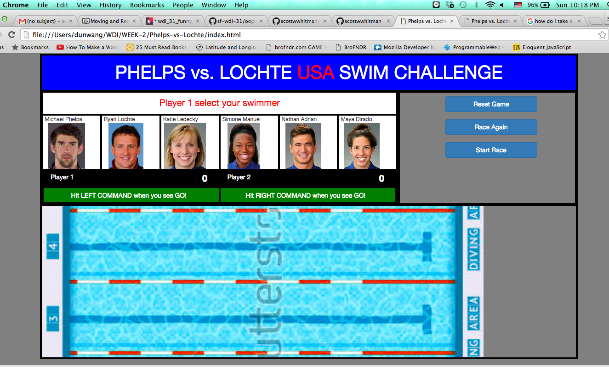
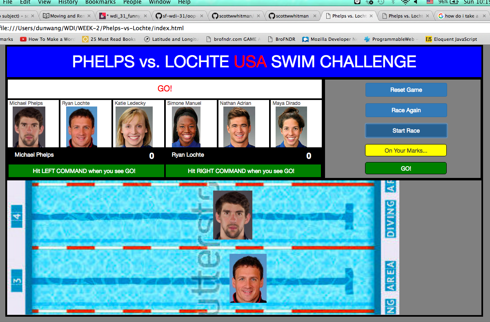
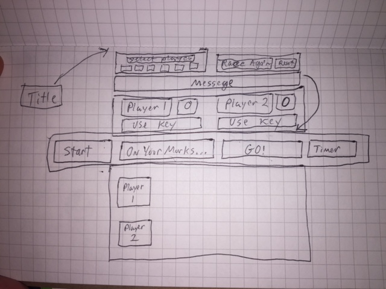
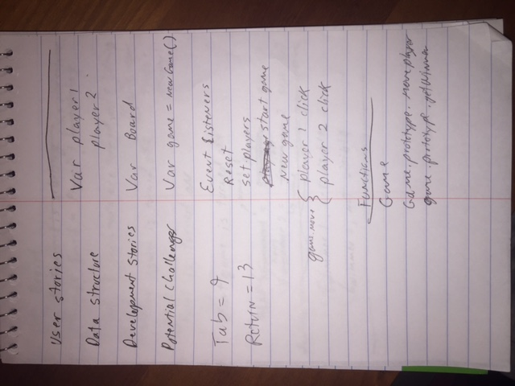
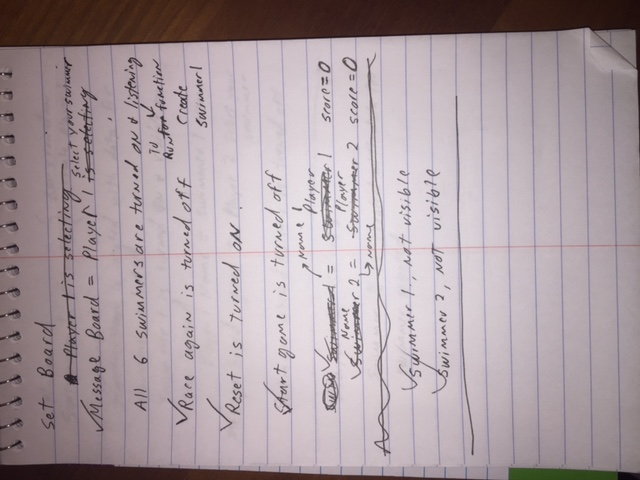
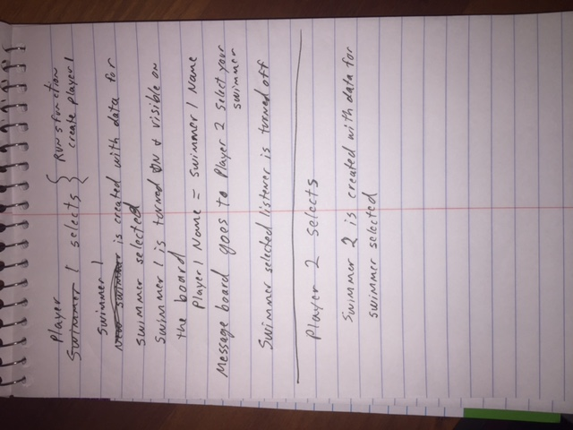

# Phelps-vs-Lochte USA Swim Challenge - Scott Whitman

**Objective:** Build a racing game for Project O.

**Description:** Two players can select from 6 different swimmer profiles to race across the board.  The game includes a countdown to the race, displays the winner, and keeps track of the score.  Players can race again with the same swimmers, or reset to choose new swimmers and reset the score board.

**Link to the App:**  <a href="https://scottwwhitman.github.io/Phelps-vs-Lochte.github.io/">Phelps-vs-Lochte</a>

## Technologies used
* HTML   
* CSS  
* JavaScript
* JQuery
* Handlebars
* Bootstrap
* A touch of object oriented programming

## Original code / project instructions
* Original instructions:   
<a href="https://github.com/sf-wdi-31/project-0">Project O instructions</a>

* My original user stories, data structure, development stories and potential challenges:
<a href="https://github.com/scottwwhitman/oop-game-training">Original scripting</a>

## Interesting code I built
* Built a data sheet in data.js, where all the player profile info is drawn from.
* Built in a countdown timer in line 130 of app.js
* Built in a handlebars script to pull swimmer photos and data from data.js in lines 47-55 of index.html, and the corresponding javascript in lines 19-22 of app.js
* Built a function to set the board and create objects for swimmer1 and swimmer2 in lines 76-113 of app.js
* Built a function to move the swimmers and test for a winner by accessing and manipulating the objects created for swimmer1 and swimmer2

## Problems I have encountered
* 1) There is one bug in the game I found.  When the player hits Race Again or Reset Game, everything works fine, except with the players race, the program is hearing an additional keypress for each new game played.  As a result, it looks like each race that is played "speeds up".  The problem is cleared with a refresh.  Still working to solve this problem.

* 2) Need to add responsiveness so game formats correctly on different screens.

## Screenshots
* Game start screen:

* Game race screen:

* Draft wireframes:

* Pseudocode 1:

* Pseudocode 2:

* Pseudocode 3:

